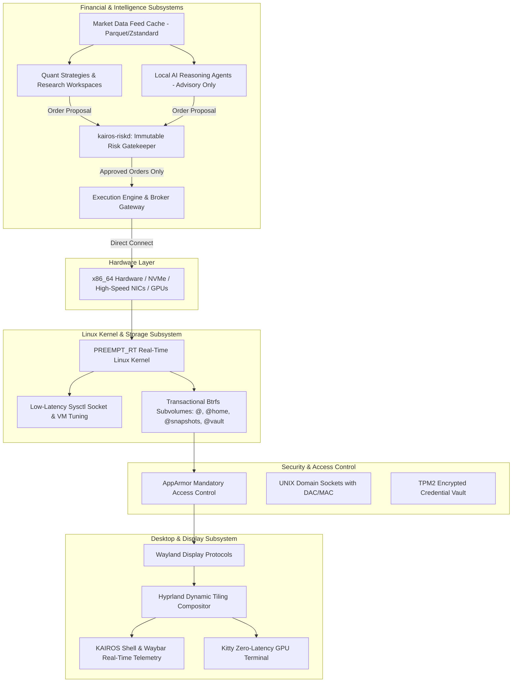

# KAIROS OS Architectural Specification

## 1. Executive Summary

**KAIROS OS** is an engineered, purpose-built Linux operating system crafted specifically for quantitative researchers, algorithmic traders, quantitative developers, and autonomous market operators.

Rather than being a simple window manager theme, web dashboard, or dotfiles collection, KAIROS OS is an integrated operating environment providing:
- Deterministic low-latency PREEMPT_RT kernel scheduling
- Transactional rootfs storage architecture with atomic rollbacks
- Hardware acceleration & multi-monitor Wayland tiling workspace
- Strict privilege separation and Mandatory Access Control (AppArmor)
- An unbypassable financial execution security pipeline:
  $$\text{Signal} \longrightarrow \text{Decision} \longrightarrow \mathbf{Risk} \longrightarrow \text{Execution} \longrightarrow \text{Broker}$$

---

## 2. Core Architectural Principles & Invariants

### 2.1 Autonomous OS Stability
> **Fundamental Law**: KAIROS must remain completely stable, bootable, manageable, and performant even if every trading daemon, AI reasoning engine, plugin, and adaptive feedback controller is disabled or removed.

Trading and intelligence modules run strictly as managed services upon an enterprise-grade Linux substrate. System recovery and hardware diagnostics are independent of application runtime health.

### 2.2 Unbypassable Risk Invariant
> **Risk Law**: All financial transactions, order proposals, algorithmic strategies, and AI agent outputs must pass through the `RiskGatekeeper` daemon (`kairos-riskd`). No component—regardless of elevated privileges or machine learning confidence—can route directly to an execution gateway or broker.

The risk gatekeeper verifies:
- Position sizes against portfolio exposure thresholds
- Maximum historical and intraday drawdown boundaries
- Dynamic circuit breaker triggers
- Pricing sanity against market tick data

### 2.3 System Privilege Separation
Processes are isolated into distinct operating rings and security roles:
- **`operator` / `wheel`**: System administrator and OS maintenance
- **`quant`**: Research analytics, Python/DuckDB data pipelines, and backtesting (unprivileged execution)
- **`trader`**: Live strategy processes emitting signals (sandboxed)
- **`riskadmin` / `kairos-risk`**: Dedicated system user running the risk gatekeeper daemon with memory locking rights and isolated IPC

---

## 3. Subsystem Architecture

---

## 4. Repository Layout & Component Demarcation

- `/boot`: EFI system partition configs, GRUB2, systemd-boot loader stanzas, and UKI generation rules.
- `/build`: Intermediate compilation outputs and rootfs staging trees.
- `/config`: System baseline definitions (`base_packages.ini`, `os-release`, `sysctl`, `nftables`, `hyprland.conf`).
- `/docs`: Full architectural design documents, ADRs, build guides, and security manuals.
- `/kernel`: Kernel configuration fragments (`config-kairos-rt.fragment`), build patches, and modules.
- `/iso`: Hybrid ISO mastering definitions, GRUB el-torito assets, and squashfs specifications.
- `/packages`: Target package manifests and Flatpak sandboxing configurations.
- `/system`: Base system initialization, FHS specifications, and hardware hooks.
- `/services`: Core system daemons (`kairos-riskd`, `kairos-watchdog`, telemetry units).
- `/desktop`: Wayland compositor configs, Hyprland profiles, and display session metadata.
- `/shell`: KAIROS Shell components (Waybar configurations, CSS themes, financial status ribbons).
- `/apps`: User-facing terminal utilities and settings applications (`kairos-control`).
- `/plugins`: Capability-based plugin host system with sandboxed execution.
- `/trading`: Trading infrastructure core (`risk_gatekeeper.py`, order types, protocol bridges).
- `/research`: Quantitative research environment definitions, Polars/DuckDB profiles, and tick caching.
- `/agents`: Local AI reasoning agents operating strictly within advisory bounds.
- `/adaptive`: Adaptive Evolution Intelligence (AEI) system telemetry and safe runtime auto-tuning.
- `/security`: AppArmor profiles, PAM configurations, and TPM2 key storage architecture.
- `/scripts`: Foundational orchestration scripts (env detect, build, test, clean, package, iso, vm-boot, hardware validation).
- `/tests`: Automated test suites validating architecture invariants, security rules, and build scripts.
- `/tools`: Auxiliary developer and distribution engineering utilities.
- `/recovery`: Snapshot management, disaster recovery, and A/B update engines (`kairos-update`).
- `/installer`: Automated system installation and storage partitioning engine (`kairos-install`).
- `/assets`: Artwork, logos, default wallpapers, and visual identity assets.

---

## 5. Architectural Decision Process

All non-trivial architectural decisions affecting stability, security, or latency must be recorded in `docs/adr/` using the standard ADR format:
1. Status (Proposed, Accepted, Deprecated, Superseded)
2. Context
3. Decision
4. Consequences (Positive, Negative, Neutral)
